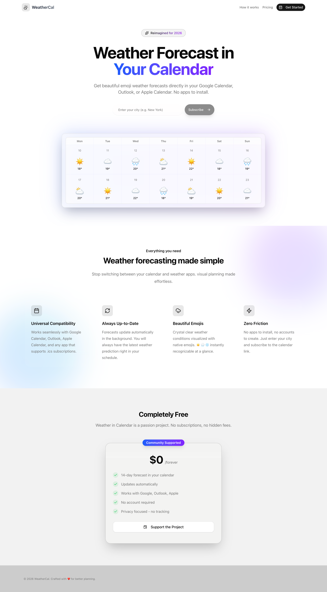

<h1 align="center">🌤️ Weather in Calendar</h1>

<div align="center">

[](https://nextjs.org/)
[](https://tailwindcss.com/)
[](https://www.typescriptlang.org/)

</div>

A modern, premium web application that allows users to seamlessly integrate weather forecasts into their calendar events through an elegant, intuitive interface.

## ✨ Features

### 🎨 Modern Landing Experience

• Immersive Hero Section: Gradient backgrounds with smooth animations
• Glassmorphism UI: Premium-feeling cards showcasing key features
• Responsive Design: Optimized for mobile, tablet, and desktop
• Dark Mode Support: Automatic system preference detection

### 🔄 Interactive Calendar Integration

• Smart City Input: Enter your location for personalized weather data
• Realistic Flow: Generate button with loading states and success dialogs
• ICS File Generation: Downloadable calendar files with embedded weather events
• Copy to Clipboard: One-click sharing with visual feedback

### 🌍 Internationalization Ready

• Multi-language Support: Full English & Chinese localization
• next-intl Integration: Seamless language switching
• Locale-aware Routing: `/en` and `/zh` routes with persistent layout

### ⚡ Modern Tech Stack

• Next.js 15 (App Router): High-performance React framework
• Tailwind CSS v4: Utility-first styling with latest features
• shadcn/ui: Accessible, high-quality UI components
• Lucide Icons: Consistent, crisp iconography throughout



 ## 🚀 Getting Started

 ### Prerequisites

 • Node.js 18.17 or later
 • npm or yarn

 ### Local Development

 1. Clone the repository

 ```bash
 git clone https://github.com/gandli/weather-in-calendar.git
 cd weather-in-calendar
 ```

 2. Install dependencies

 ```bash
 npm install
 ```

 3. Set up environment variables (optional)

 Copy `.env.example` to `.env.local`:

 ```bash
 cp .env.example .env.local
 ```

 4. Run the development server

 ```bash
 npm run dev
 ```

 Open [http://localhost:3000](http://localhost:3000) to view the application.

 ## 📱 Usage

 ### Basic Workflow

 1. Visit the landing page and explore the features
 2. Enter your city name in the input field (e.g., "上海", "New York")
 3. Click the "Subscribe" or "订阅日历" button
 4. Your calendar app will open automatically with the webcal:// protocol
 5. Confirm the subscription to start receiving weather forecasts

 ### Language Switching

 • Use the language selector in the navigation
 • Routes automatically switch between `/en` and `/zh`
 • All content updates dynamically

 ## 🏗️ Project Structure

 ```
 src/
 ├── app/                    # Next.js App Router
 │   ├── [locale]/          # Internationalized routes
 │   │   ├── layout.tsx
 │   │   └── page.tsx
 │   ├── api/ics/          # ICS calendar generation API
 │   │   └── route.ts
 │   ├── globals.css
 │   └── layout.tsx
 ├── components/            # Reusable UI components
 │   ├── ui/               # shadcn/ui components
 │   ├── navbar.tsx
 │   ├── hero.tsx
 │   ├── features.tsx
 │   ├── pricing.tsx
 │   └── footer.tsx
 ├── lib/                   # Utility functions
 │   └── utils.ts
 ├── i18n.ts               # Unified i18n configuration
 └── messages/              # Translation files
     ├── en.json
     └── zh.json
 ```

 ## 🧪 Development

 ### Available Scripts

 ```bash
 npm run dev          # Start development server
 npm run build        # Build for production
 npm run start        # Start production server
 npm run lint         # Run ESLint
 ```

 ### Building for Production

 ```bash
 npm run build
 ```

 The build process includes:
 • TypeScript type checking
 • Internationalized route generation
 • Optimized bundle generation
 • API routes for dynamic ICS generation

 ## 🌐 Deployment

 ### Vercel (Recommended for Production)

 **Why Vercel?**
- Native support for Next.js API Routes
- Edge Functions for global performance
- Free tier with generous limits
- Automatic HTTPS and CDN
- Seamless Git integration

 **Deploy Steps:**

 1. Push your code to GitHub
 2. Go to [vercel.com/new](https://vercel.com/new)
 3. Import your repository
 4. Click "Deploy" - Vercel auto-detects Next.js
 5. Done! Your app is live at `https://your-app.vercel.app`

 **Environment Variables (Optional):**
- `QWEATHER_API_KEY`: For real weather API integration (using QWeather/HeFeng Weather). Defaults to a trial key if not set.
- `QWEATHER_API_HOST`: API host for QWeather (optional).

 **Deployment URL Example:**
```
https://your-app.vercel.app/zh/api/ics?city=上海
```

 ### GitHub Pages (Static Only - Limited Functionality)

 ⚠️ **Important:** GitHub Pages does NOT support API routes. The webcal subscription feature requires server-side rendering.

 If you deploy to GitHub Pages, only the frontend will work. The calendar subscription feature will **not** function.

 ### Manual Deployment

 ```bash
 npm run build
 npm start  # Run production server locally
 ```

### Styling

• Tailwind CSS v4 configuration in `tailwind.config.ts`
• Custom CSS variables in `src/app/globals.css`

## 📈 Next Steps

### Immediate Enhancements

• [x] Real Weather API Integration
• [ ] Advanced Calendar Customization
• [ ] User Accounts and preference storage

### Future Roadmap

• [ ] Mobile App (React Native)
• [ ] Calendar provider integrations (Google / Outlook)
• [ ] Weather alerts and notifications
• [ ] Usage analytics and insights

## 🤝 Contributing

Contributions are welcome!

1. Fork the project
2. Create your feature branch (`git checkout -b feature/amazing-feature`)
3. Commit your changes (`git commit -m 'Add some amazing feature'`)
4. Push to the branch (`git push origin feature/amazing-feature`)
5. Open a Pull Request

## 📄 License

This project is licensed under the MIT License - see the LICENSE file for details.

## 🙏 Acknowledgments

• Built with Next.js and Tailwind CSS
• UI components from shadcn/ui
• Icons from Lucide

---

Built with ❤️ using modern web technologies
