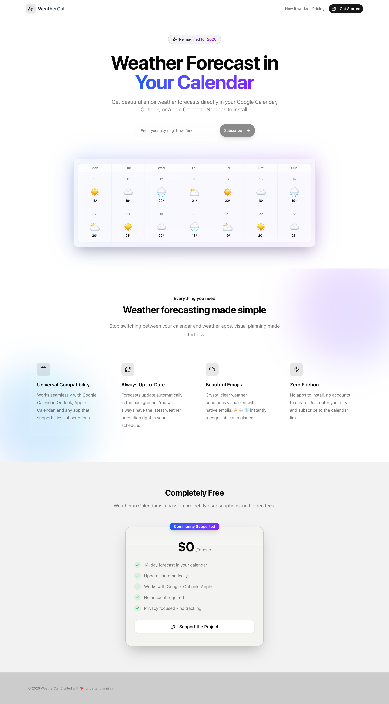

<h1 align="center">🌤️ Weather in Calendar</h1>

<div align="center">

[](https://nextjs.org/)
[](https://tailwindcss.com/)
[](https://www.typescriptlang.org/)

</div>

A modern web app that integrates weather forecasts into calendar events — enter a city, get an ICS calendar subscription with embedded weather, bilingual (EN/中文).



## ✨ Features

- **📅 ICS Calendar Generation** — `/api/ics` returns a `text/calendar` feed; subscribe once, weather updates in your calendar app (webcal protocol)
- **🌍 Bilingual** — full English & Chinese localization via next-intl, locale-aware routing (`/en`, `/zh`)
- **🎨 Modern UI** — glassmorphism cards, dark mode via system preference, responsive across mobile / tablet / desktop
- **🧩 Modern Stack** — Next.js 15 App Router · Tailwind CSS v4 · shadcn/ui · Lucide icons

## 🚀 Getting Started

### Prerequisites

- Node.js 18.17+
- npm

### Local Development

```bash
git clone https://github.com/gandli/weather-in-calendar.git
cd weather-in-calendar
npm install

# optional: environment variables
cp .env.example .env.local

npm run dev
```

Open [http://localhost:3000](http://localhost:3000).

## 📱 Usage

1. Visit the landing page and enter your city name (e.g. "上海", "New York")
2. Click the "Subscribe" button — your calendar app opens via the `webcal://` protocol
3. Confirm the subscription to start receiving weather forecasts in your calendar

Language switching: use the selector in the navigation; routes switch between `/en` and `/zh` automatically.

## 🧪 Available Scripts

```bash
npm run dev               # Start development server
npm run build             # Build for production
npm run start             # Start production server
npm run lint              # Run ESLint
npm run test              # Basic API/util tests
npm run build:cloudflare  # Build for Cloudflare Workers
npm run deploy:cloudflare # Deploy to Cloudflare
```

### API Error Codes

All API endpoints return a unified error shape:

```json
{ "code": "BAD_REQUEST", "message": "City parameter is required" }
```

Common codes:

- `BAD_REQUEST` - missing/invalid query params
- `INVALID_CITY` - city format/length/encoding is invalid
- `CITY_NOT_FOUND` - upstream weather provider cannot resolve city
- `INTERNAL_ERROR` - unexpected server-side failure

Observability: `X-Request-Id` response header for tracing, `Server-Timing` for latency; API logs redact city inputs.

## 🌐 Deployment

The repo ships both `vercel.json` and `wrangler.jsonc`; pick one:

### Vercel

1. Push your code to GitHub
2. [Import the repository on vercel.com/new](https://vercel.com/new) — Vercel auto-detects Next.js
3. Optional env var: `NEXT_PUBLIC_OPENWEATHER_API_KEY` (for future real weather API integration)

> Note: GitHub Pages will NOT work — the webcal subscription feature requires server-side API routes.

### Cloudflare Workers

```bash
npm run build:cloudflare
npm run preview:cloudflare   # local preview
npm run deploy:cloudflare    # deploy
```

See [CLOUDFLARE_DEPLOYMENT.md](CLOUDFLARE_DEPLOYMENT.md) for the complete guide.

## 🤝 Contributing

Contributions are welcome! Fork → feature branch → commit → PR.

## 📄 License

Not yet specified (no LICENSE file in the repo).
